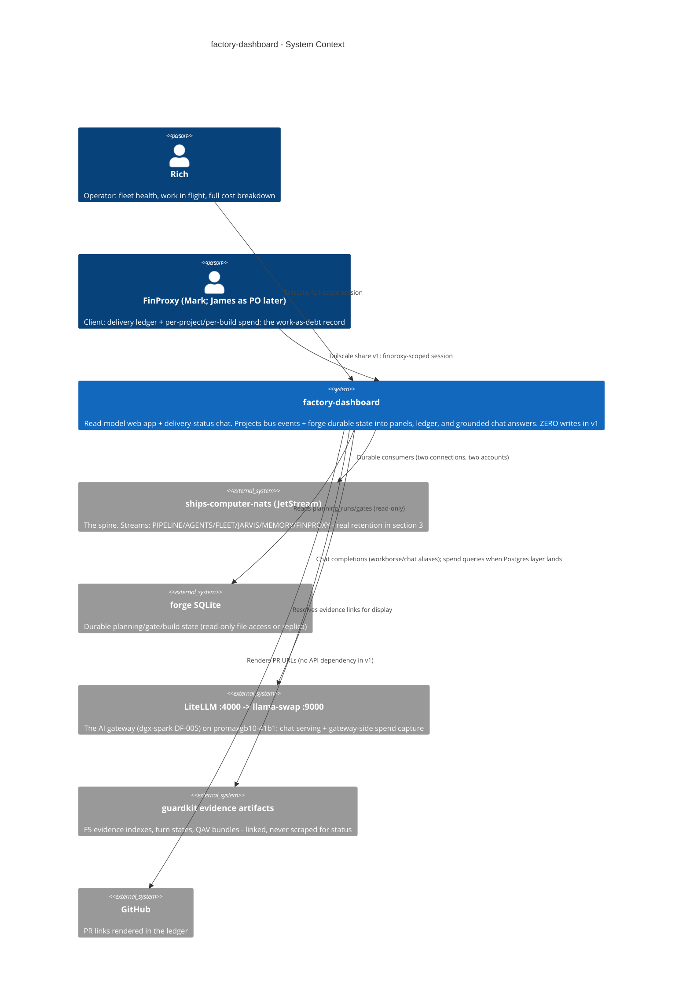
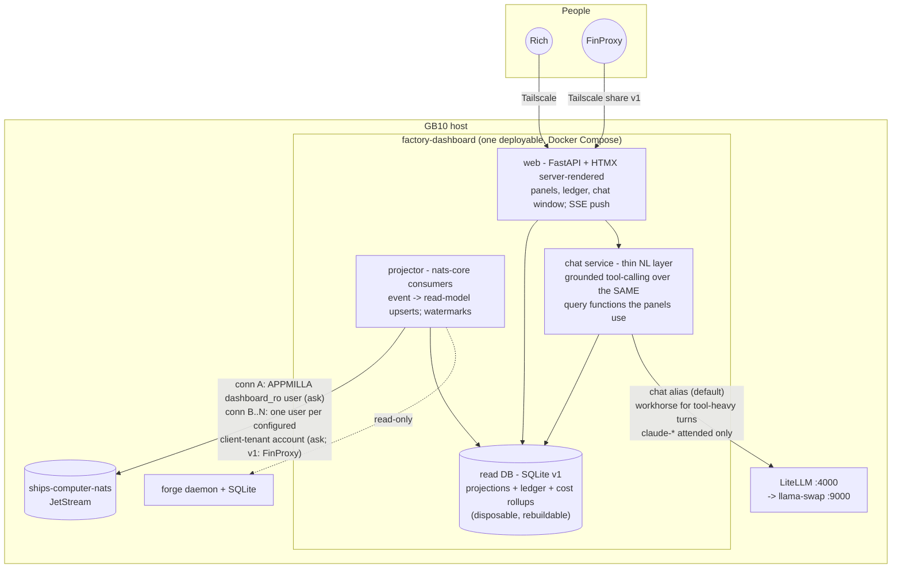

# Factory Dashboard — System Architecture (/system-arch)

**Status:** v1 · 2026-07-08 · authored by the fleet-dashboard architecture-refresh session (Fable 5,
kickoff P19 in `ai-transition/docs/kickoff-prompts-fable-sessions-2026-07-07.md` Round 5).
Produced on the `/system-arch` skill spine run in kickoff-scripted form: the skill's six question
categories are answered by decisions already made (the 19-June starter's D1–D6, the 2026-07-07
factory canon, dgx-spark DECISION-DF-005, and Rich's 2026-07-08 cost-lens steer) — no interactive
session was possible or needed. House style: one self-contained dated doc with inline ADRs, not
the skill's file-per-artifact layout (deviation noted; substance identical).
**Consumer:** the `/system-design` doc beside this one (the contract layer); the build-plan
sessions; WS2 B13's graduation review (the D14 paragraph, §8); Rich.
**Companions (read, not duplicated):**
`docs/research/factory-dashboard-conversation-starter.md` (the product brief — now carries a
supersession banner pointing here) ·
`ai-transition/docs/factory-architecture-c4-2026-07-07.md` (the fleet this sits beside) ·
`ai-transition/docs/factory-gap-analysis-2026-07-07.md` (verified state of record) ·
`ai-transition/docs/factory-program-plan-2026-07-07.md` (calendar + sequencing) ·
`dgx-spark/DECISION-DF-005-single-spark-serving-topology-litellm-front-door.md` +
`dgx-spark/RUNBOOK-litellm-front-door.md` (the serving path) ·
`fleet-memory/docs/design/backward-edge-episode-schema-contract-2026-07-07.md` (the six episode
types) · this repo's `docs/architecture/factory-dashboard-system-design-2026-07-08.md`,
`wire-consumer-requirements-2026-07-08.md`, `build-plan-2026-07-08.md`.

**Decisions this doc does NOT reopen:** the starter's D1–D6; fleet DF-001/003/008/009; D4/D13
("more producers/consumers on the bus, never a new brain"); dgx-spark DF-005 (cite repo-qualified —
ai-transition's DF-005 is a different, still-reserved register slot); integration seam v1.

---

## 0 · The one-sentence system

> A **read-model web app + grounded delivery-status chat** over the bus and durable state the
> factory already produces: one NATS consumer + one small read DB render two views — Rich's
> operational panels and FinProxy's commercial delivery ledger — and answer three questions per
> feature and per project (*how far through · on track? · what are the issues*) from typed query
> tools that the panels and the chat share, so they can never disagree. It orchestrates nothing,
> writes nothing, and runs on owned hardware.

**The product thesis (Rich, 2026-07-07):** building with AI, kanban boards are the wrong surface —
and the fleet's own tracker rot proves it (~400+ stale task files fleet-wide, gap §4a: the boards
already lie). The events are the truth. This app is the surface that renders the truth.

---

## 1 · Level 1 — System Context

*Look for: every arrow out of `dash` is a READ. The only write it will ever make is the later
PO-panel approve action through the existing gate mechanism (starter D5/warning §1) — and that is
explicitly out of v1.*

**Boundary notes:**
- The dashboard is **not on the factory's critical path**. If it is down, nothing stops (starter
  invariant). It holds no orchestration state; its read DB is a disposable projection,
  rebuildable from the bus + forge SQLite.
- The **AI gateway is on the chat's serving path only** — panels never call a model. DF-001 is
  inherited structurally: the gateway config names no cloud model and ships empty fallback lists
  (dgx-spark DF-005 §2.3); the chat is an *attended* surface, so frontier-via-gateway is
  permitted but is not the default (ADR-DASH-005).
- **guardkit evidence artifacts are linked, never parsed for status** — status comes from events
  and forge durable state (correction 2 to the starter; gap §4a). Evidence files are displayed
  to humans (Rich's view) or referenced by id (FinProxy's view, DF-008-filtered).

---

## 2 · Level 2 — Containers

*Edge key: solid = runtime call · dotted = read-only data-plane. The projector is the ONLY writer
of the read DB; web and chat are readers. No container publishes to NATS in v1.*

| Container | Responsibility | Tech | Why |
|---|---|---|---|
| **web** | Server-rendered panels + ledger + chat window; SSE push; session→tenant resolution | FastAPI + Jinja + HTMX | ADR-DASH-003 |
| **projector** | Durable NATS consumers via `nats-core`; forge SQLite mirror; idempotent upserts into the read DB; per-stream watermarks | Python + `nats-core` 0.5.x | the one component that touches the bus |
| **chat service** | Tool registry (tenant-bound), tool-call loop against LiteLLM, citation assembly, refusal enforcement | Python, OpenAI-compat client → `:4000` | ADR-DASH-005 |
| **read DB** | Projections, ledger, issue register, cost rollups, consumer watermarks | SQLite (WAL) v1 | ADR-DASH-001 |

**Placement beside the C4 §2 fleet:** the dashboard is a new consumer box on the existing GB10
diagram, subscribing to the same broker jarvis/forge already share — exactly the D4/D13 shape
(*more consumers on the bus, never a new brain*). It adds no reasoning seat to the factory: the
chat's model turns are presentation-layer NL over deterministic queries, served by the
already-decided gateway, not a new orchestration brain.

---

## 3 · Corrections to the starter's premises (binding, verified on disk 2026-07-08)

These reshape the design and are carried into every companion doc:

1. **"The bus already emits everything" is FALSE for the back half** (gap §4d). What exists in
   nats-core 0.5.0 (`src/nats_core/topics.py`, `events/_pipeline.py`) is richer than the C4 §2
   wire table's summary — the full build lifecycle family exists as contracts
   (`BuildQueued/Started/Progress/Paused/Resumed/Cancelled/Complete/Failed`,
   `StageComplete/StageGated`, and `BuildCompletePayload` already carries `pr_url`, task counts,
   `duration_seconds`) — but **nothing exists for deploy, QA verdict, live gate, or planning
   lifecycle beyond PLANNING_QUEUED**. Those are WS2 B7 and WS1-I, both unrun. Every panel and
   chat tool therefore carries a ✅/🟡/📋 feed status (design doc §2).
2. **Tracker rot** (gap §4a): the dashboard projects from bus events + forge durable state +
   (for display only) guardkit evidence artifacts. It **never scrapes feature/task YAML boards**
   for status.
3. **Retention reality refutes the starter's replay premise** (verified against
   `nats-infrastructure/streams/stream-definitions.json`): PIPELINE is **workqueue retention,
   7d/10k** — not "limits 30d". A workqueue stream deletes messages as its consumer acks them
   and does not tolerate overlapping observer consumers; AGENTS is limits 24h/5000; FLEET and
   JARVIS are 1h; only MEMORY is long (365d/100k). **JetStream replay cannot serve the ledger.**
   Consequence: ADR-DASH-001 (durable read DB; D6's intent honoured, its mechanism corrected)
   and infra asks IN-1/IN-2 (wire note §4).
4. **The FINPROXY account today has one user (`mark`)** — no `james`, no `rich_finproxy`
   (`config/accounts/accounts.conf.template:163-175`) — and **zero cross-account exports/imports
   exist**. Nothing currently publishes on `finproxy.>`. The FinProxy feed is therefore a named
   gap with named asks (ADR-DASH-002; wire note §3/§4), not an assumed capability.
5. **The six backward-edge episode types** (fleet-memory contract @ `974669c`:
   `planning_outcome, approval_decision, deploy_record, live_verdict, grading_outcome,
   spec_survival`) are much of the ledger's *future* substance, riding the long-retention MEMORY
   stream — producers land WS1-E/WS2-B8/WS4-S4/S7. The dashboard subscribes to
   `memory.episode.>` from day one so those rows appear the moment producers exist (📋 rows in
   the matrix).
6. **Cost capture partially exists already**: guardkit's `LLMCallEvent`
   (`orchestrator/instrumentation/schemas.py:146`) carries provider/model/input_tokens/
   output_tokens/latency per Player/Coach call — but the default emitter is `NullEmitter`
   (nothing persists) and `model` frequently falls back to the literal `"default"`. The cost
   lens's frontier-lane ask is therefore **rollups + emitter wiring**, not new per-call fields
   (wire note §2).

---

## 4 · The tenancy model: operator + configured client tenants (ADR-DASH-002)

**Decision (2026-07-08): tenancy is enforced at the NATS account boundary and at the tool layer —
never in the UI.** Restates and mechanizes starter D3.

> **Dated amendment 2026-07-08 (Rich's steer, same day): nothing is hardcoded to FinProxy.**
> The client side of the model is a **configured tenant registry**, not a named client: each
> client tenant is a config row `{tenant_slug, display_name, nats_account, subject_prefix,
> projects: [repo, …]}` — and a tenant may own **one or more repos/projects** (a real client
> engagement is often several). Every "FinProxy" below is shorthand for *the first configured
> instance* of that row; adding a second client is a config + WS5-provisioning act (new account
> pair per IN-4, new registry row, new client store), never a code change. Per-project rollups
> nest inside the tenant: a client sees each of their repos' delivery and spend separately plus
> the tenant total.

- The projector holds **one connection per scope**: connection A as a new read-only APPMILLA
  service user (`dashboard_ro`; provisioning ask IN-3 — grant shape as re-cut by the gate), and
  **one connection per configured client tenant**, as a user inside *that tenant's* NATS
  account, which can physically see only `{tenant_prefix}.>` (ask IN-4; v1 instantiates
  exactly one: FinProxy).
- **Per-tenant read stores, not one filtered store:** connection A feeds the operational
  projections; each tenant connection is the *sole* feeder of that tenant's client store
  (`ledger_client_{tenant}.db`). A client session's queries — panel and chat alike — execute
  only against its own tenant's store. There is no code path from a client session to the
  operational store or to another tenant's store; the isolation is structural (separate DB
  file per tenant), not a WHERE clause.
- **The feed gap, stated honestly:** because accounts are fully isolated and no producer
  publishes on `finproxy.>` today, the FinProxy view is **dark at birth**. Lighting it requires
  (a) forge publishing a **client-facing, DF-008-reduced delivery event** on `finproxy.>`
  (subject shape per the `Topics.for_project()` convention, `topics.py:183-198`) — wire ask
  A-8 — and (b) an APPMILLA→FINPROXY export/import of `finproxy.>` in `accounts.conf` — infra
  ask IN-4. Until both land, FinProxy sees an honest "ledger feed pending" state. **We do not
  bridge the gap app-side**: having the dashboard re-publish or copy APPMILLA-derived rows into
  the FinProxy store would make the app the tenancy boundary — exactly what D3 forbids.
- **What may ride `{tenant_prefix}.>` (gate finding, 2026-07-08 — BLOCKER-fixed):** a client
  account's own users subscribe their prefix **directly with raw NATS credentials** (verified
  for the first instance: FINPROXY's `mark` subscribes `finproxy.>`) — whatever is published
  there is client-visible with no dashboard in the path. So A-8 is explicitly NOT
  "tenant-prefixed copies of internal payloads" (BuildComplete carries tasks_failed/branch;
  verdict payloads carry evidence refs — all DF-008-forbidden): it is a **distinct reduced
  event** carrying only feature id, title, **project/repo** (a tenant owns several), bar,
  delivered date, PR URL, and the per-build spend total. The DF-008 firewall is enforced at
  the *producer*, at the account boundary — never one layer late in the projector. This also
  closes the cost-feed hole: with per-build spend riding the reduced event, per-project and
  per-tenant spend are in-store sums inside `ledger_client_{tenant}` — no APPMILLA-derived
  cost row ever crosses app-side (gateway-side seat spend stays out of client scope in v1,
  named in the coverage note).
- **DF-008 field firewall** (checked per-field in the design doc's matrix): client-visible
  records carry feature id/title, project/repo (within the tenant's own configured set only),
  delivery bar cleared, PR URL, dates, and per-project/per-build/per-tenant spend (Rich's
  2026-07-08 steer) — never coach scores, turn counts, agent internals, fleet diagnostics,
  evidence file paths, or seat-level cost splits. Cost visibility is per-audience **by
  design**, not blanket-hidden.
- **Session→tenant mapping** (starter open question 4): the web app authenticates users to a
  tenant registry row (v1: server-side session + per-user credential; Tailscale provides the
  network boundary), and the tenant selects which read store and which chat tool registry the
  session is bound to. NATS credentials never reach the browser.

---

## 5 · FinProxy access decision (ADR-DASH-004)

**Decision (2026-07-08): v1 access is Tailscale, port-scoped** — a Tailscale share restricted
by ACL to the dashboard's web port ONLY (never a host-level share: the host also listens on
NATS monitoring :8222, llama-swap :9000, and LiteLLM :4000, none of which are tenant-scoped —
gate finding, 2026-07-08). Same human-mediated mechanism the HSBC demo already uses (lpa
runbook precedent). A
hosted authenticated view (AWS, Docker Compose lift) remains the low-risk later move, tied to the
hosted-self-serve fork exactly as the starter framed it — **not a v1 prerequisite**. Rationale:
the FinProxy audience is currently one named person (Mark; James when the PO panel lands); asking
one person to accept a Tailscale share is cheaper than building auth hardening for a
public-internet surface, and it keeps the zero-external-dependency posture (D2) intact for v1.
Revisit trigger: a second FinProxy-class tenant, or the PO panel going live.

---

## 6 · Frontend stack decision (ADR-DASH-003)

**Decision (2026-07-08): HTMX-first, confirmed against the FinProxy polish bar.** Server-rendered
FastAPI + Jinja + HTMX + SSE; no SPA, no build toolchain.

- **Who maintains it:** Rich plus the factory's own autobuild lane. One language (Python) and
  zero frontend toolchain is the shape the Player/Coach loop demonstrably ships well; a
  React/SPA adds a second ecosystem to the maintenance surface for no v1 capability gain.
- **The polish bar:** FinProxy's v1 surface is a ledger table, a per-project rollup, a chat
  window, and spend figures — document-shaped content that server-rendered HTML + a good
  stylesheet serves at client quality. The chat window is a form POST + SSE token stream, which
  HTMX handles natively.
- **The push contract falls out:** SSE (one-directional server push) over WebSocket — panels are
  read-only in v1, so there is no client→server channel to justify WS; SSE reconnect semantics
  are simpler and proxy-friendly. (Design doc §5 pins the contract.)
- **Revisit trigger:** the hosted-self-serve fork or the interactive PO panel demanding richer
  client state — with a dated note, per house rules.
- Kotlin/Compose-web (the starter's option c) is rejected for v1: wrong maintenance surface for
  this fleet's Python-centred autobuild lane.

---

## 7 · The delivery-status chat (the new first-class feature) (ADR-DASH-005)

**The three questions** a delivery manager actually asks — *how far through are we · are we on
track · what are the issues* — are first-class in the status model, per feature and per project:

| Question | Computed from | Canon anchor |
|---|---|---|
| **Progress** | stage position on the C4 §3 journey (intake → planning → approval → spec/plan → build → merge → *deploy → live-verify* 📋) + wave/task completion from build events | C4 §3; `BuildProgressPayload` |
| **On track?** | trend vs the gap-§2 calibrated norms: attempts per feature, turns, gate failures, stage dwell times (the norms that separated "9 runs with false verdicts" from "first-run honest completions") | gap §2 |
| **Issues** | escalations, gate REJECTED, approval-waiting-on-named-human (with age), seam findings, stalled runs (no event past threshold), build failures | approval/gate payloads; issue register (design doc §3) |

**Binding design rules:**
1. **The chat is a thin NL layer over the SAME typed query tools that power the panels**
   (`feature_status`, `project_rollup`, `open_issues`, `delivered_period(tenant, window)`,
   `cost_summary(scope, window)` — contracts in the design doc §6). Panels and chat read the
   same functions, so they can never disagree.
2. **Grounded tool-calling only — never free-form generation over raw logs.** The model's only
   inputs are the user turn and tool results; every answer cites its records (feature ids, event
   timestamps, evidence links) and **refuses beyond its data** ("I have no deploy events for
   FEAT-X; deploy tracking lands with WS2 B7/B8" is a designed answer, not a failure).
3. **Tenancy at the tool layer:** a FinProxy session's tool registry is constructed bound to the
   `ledger_finproxy` store — the tools physically cannot query outside `finproxy.>`-derived
   data. Not a prompt instruction; a code-level binding (§4).
4. **The chat originates NOTHING** (DF-009): no planning requests, no approvals, no writes. The
   planning front door stays Slack, identity-pinned. When the PO panel later folds in, its
   approve action uses the existing gate mechanism — a panel affordance, not a chat capability.
5. **Serving via LiteLLM `:4000`** per dgx-spark DF-005 (client → LiteLLM → llama-swap :9000, on
   promaxgb10-41b1 over Tailscale). Local-first: default alias `chat` (gpt-oss-20b) for NL turns,
   `workhorse` (Qwen3.6-35B) for tool-heavy turns; the chat is an attended surface so `claude-*`
   frontier-via-gateway is **permitted but not default** (and on this gateway `claude-*` routes
   local unless a cloud model is deliberately configured — the public config names none;
   DF-001's guard is structural). Panels make zero model calls.
   **No-eviction rule (gate finding, 2026-07-08):** when a factory build holds the serving GPU
   (the Coach's model resident), a chat turn must never trigger a llama-swap model eviction —
   the chat pins to whatever model is already resident, or degrades to the raw-table rendering
   (design DDR-DASH-003). The dashboard being *used* must not slow the factory any more than
   the dashboard being *down* stops it.
6. **The Slack twin seam (named, not built):** jarvis could later expose the same tool registry
   conversationally — same typed tools, second renderer, still zero new brains. The tool layer
   is designed registry-shaped (name → handler + schema + tenant binding) so that lift is a
   transport adapter, not a redesign.

---

## 8 · The cost lens (ADR-DASH-006) — and the Workstream-A remainders (the B13 paragraph)

**Decision (2026-07-08, Rich's steer: "James will want this"):** token spend **per project and
per build/feature** is a first-class panel + chat tool (`cost_summary`), designed across two
currencies and two capture points:

- **Two currencies, kept as separate columns, never summed:** frontier £ (real money) vs local
  tokens/GPU-time (~zero marginal cost; nominal £ via LiteLLM config permitted **only if
  labelled nominal**). The frontier-vs-local split per project/period is itself a KPI — the
  wasting-asset posture (program plan §8) made measurable.
- **Capture point (a) — gateway-side:** LiteLLM already returns `x-litellm-response-cost` per
  request DB-less; per-key spend/budgets arrive with the opt-in Postgres layer (dgx-spark
  runbook "does NOT cover" note). **Virtual-key naming convention (proposed for the gateway
  owner):** one key per **project × seat** — `sk-…` aliased `{project}--{seat}`, e.g.
  `study-tutor--player`, `lpa-platform-poc--chat`, `factory-dashboard--chat`, `_fleet--embed`
  for shared services — so per-project attribution **falls out of the gateway's own spend table**
  (`GROUP BY` on the key prefix) instead of being reconstructed later. The dashboard is the
  natural first consumer of that table when the Postgres layer is enabled.
- **Capture point (b) — the frontier lane that does NOT transit the gateway** (the Claude SDK
  autobuild Player; attended Claude Code sessions): attribution must ride the build/agent
  events. What already exists: guardkit `LLMCallEvent` has provider/model/token fields
  (unpersisted by default, §3.6); turn counts and durations already live in TurnStateEntity and
  `StageComplete.duration_secs`. What is genuinely missing and therefore asked (wire note §2):
  **per-stage usage rollups** (tokens by model/provider + optional cost) on the B7 payloads and
  on `BuildComplete`/`StageComplete`, plus a persistent emitter. Attended-session spend stays
  operator-reported v1 (subscription accounting is not per-request) — labelled as such, never
  silently zero.
- **Per-audience visibility (named design decision):** Rich sees the full breakdown including
  the seat/role split; **James/FinProxy see per-project + per-build spend only** — no agent
  internals, no seat split, no gateway key names (DF-008 firewall, §4). Mechanically (gate fix
  2026-07-08): a client tenant's per-build spend arrives ON the A-8 reduced delivery event
  (forge computes the total at build close from the A-4 rollups it holds); per-project and
  per-tenant spend are summed inside `ledger_client_{tenant}` across the tenant's configured
  repo set — no APPMILLA-side cost row is ever copied across, and gateway-side seat spend is
  out of client scope in v1 (coverage-labelled).

**Relationship to Workstream-A D5/D13/D14 (for WS2 B13's graduation review):** Workstream-A's
live remainders transfer via B13 (gap §6 outside-cut item 2). This architecture is their landing
place: **the dashboard is the natural D14 successor** (the FinProxy frontend, here as the
hard-scoped ledger + chat view); **the cost lens is the natural home of the D5 KPI set** (its
first pre-registered KPIs: frontier-vs-local spend split, delivered-per-period, spend-per-
delivered-feature); and **D13 metrics hosting** is subsumed by this app's read DB + panels on
owned hardware. B13 should record this doc as the transfer target rather than re-scoping them.

---

## 9 · ADR index

| ADR | Decision (all dated 2026-07-08) | Section |
|---|---|---|
| ADR-DASH-001 | **Durable read DB (SQLite v1), not in-memory/replay** — PIPELINE is workqueue 7d (verified): replay cannot serve the ledger; D6's *intent* (history from the bus, replay for bootstrap within retention) honoured, mechanism corrected with this dated note | §3.3, design §4 |
| ADR-DASH-002 | **Tenancy at the NATS account boundary + tool layer; two read stores; feed gap named, not app-bridged** | §4 |
| ADR-DASH-003 | **HTMX-first frontend; SSE push; no SPA in v1** | §6 |
| ADR-DASH-004 | **FinProxy access = Tailscale share v1; hosted view deferred to the hosted-self-serve fork** | §5 |
| ADR-DASH-005 | **Chat = grounded tool-calling over the panel query layer; LiteLLM :4000 serving, local-first; refuses beyond its data; originates nothing** | §7 |
| ADR-DASH-006 | **Cost lens: two currencies/two capture points; key-per-project×seat convention; per-audience visibility (Rich full, FinProxy per-project/build)** | §8 |
| ADR-DASH-007 | **Projection-not-participant, mechanized:** the app holds no NATS publish permission at the ACL level in v1 (`dashboard_ro` is subscribe-only; consumer plumbing is WS5-pre-created so no `$JS.>` API grant exists either — wire IN-3 as re-cut 2026-07-08) — the invariant is enforced by the broker, not by discipline. The later approve action rides a **separate NATS user (`dashboard_approve`)** loaded only in the approve handler's process context — never the projector credentials — publishing on exactly the approval-response subject, with `decided_by` set to the authenticated session user (identity is a fact, never a service constant); M-D3's zero-publish assertion on `dashboard_ro`/`dashboard_finproxy` remains permanent | §1, §4 |

**Assumptions carried (validate in build):** A1 — forge's SQLite file is readable by the
dashboard host user without contention (WAL read-only open; else a periodic copy). A2 — the
`chat` alias (gpt-oss-20b) is adequate for NL-over-tools; escalate alias per-turn if not.
A3 — `x-litellm-response-cost` is present for llama-swap-routed models (nominal pricing may need
LiteLLM `model_info` config; labelled nominal per §8). A4 — Tailscale share acceptable to Mark.

---

## 10 · What v1 explicitly is not

No orchestration, no writes, no approve action, no PO panel (seam reserved: tool registry +
per-tenant view structure are the fold-in points), no Slack renderer (seam named §7.6), no cloud
deploy (Compose lift stays low-risk and later), no scraping of task/feature YAML, no model calls
on any panel path.

---

*House rules apply: corrections to this doc require a dated note, never a silent edit. The
event→projection matrix, read-model schema, ledger semantics decision, chat tool contracts, push
contract, and the FEAT-3ED2 worked example live in the companion `/system-design` doc.*
