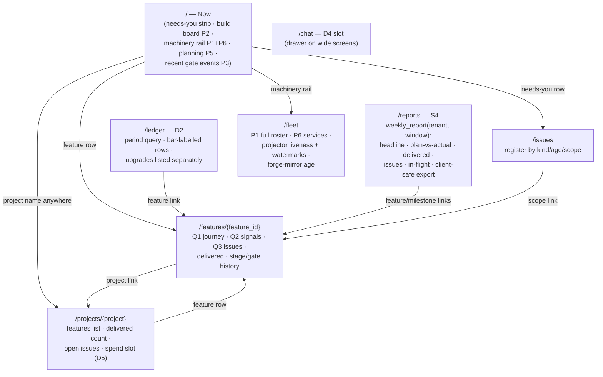

# Factory Dashboard — UX Specification (the A7 / D-UX pass)

**Status:** v1.1 · 2026-07-11 · Phase A of the orchestrated D0–D2+S4 build
(`ai-transition/docs/ways-of-working/factory-dashboard-build-handoff.md`). Authored by the Fable
coordinator session per exec-plan §1 priority 3 ("get the UX done with Fable") and adjudication A7.
**Gate:** Rich's taste-level OK on this doc greenlights Phase B (the coach-gated Opus build,
stages §9). Corrections by dated note, never silent edit.
**Consumers:** Rich (the Phase-A gate) · the Phase-B Workflow stages S1–S4 (§9 binds them) · the
later D3 (client view) and D4 (chat) sessions (§7 reserves their placements).
> **Dated amendment 2026-07-11 (Rich's steer, same day — four decisions):** (1) **James is an
> operator-side delivery-manager persona** (he authors the weekly client report; he is NOT a
> FinProxy-account user — corrects the arch C4 §1 grouping by dated note there; DF-008/A-8
> unchanged). (2) **Plan baseline = a per-tenant plan registry** (`config/plans.yaml`,
> config-is-data like `tenants.yaml`) so "behind/on-target" is computable honestly. (3) **The
> Lovable design loop = a quarantined design mirror + gated sync commands** (§7.4) — a
> follow-up lane; ADR-DASH-003 untouched. (4) **This run gains S4**: the weekly-report page v1
> (§4.7, §9.4); D0 reserves its placements. Sections §2, §4.7, §4.8, §7.4, §9.1, §9.4, §10
> carry the amendment.

**Binding upstream (this spec adds the visual/interaction layer ONLY — it reopens nothing):**
`factory-dashboard-system-arch-2026-07-08.md` ADR-DASH-001..007 ·
`factory-dashboard-system-design-2026-07-08.md` §1 (status model) §2 (matrix P1–P13) §4 (schema)
§5 (ledger semantics) §6 (SSE) §7 (auth/tenancy) §8 (file tree) ·
`build-plan-2026-07-08.md` §1 (D0–D2 rows) §2 (M-D1..M-D6) · `wire-consumer-requirements-2026-07-08.md`
§4 (IN-1/IN-3). Where this doc and those disagree, THOSE win and this doc gets a dated correction.

---

## 1 · UX principles

1. **The three questions are the information hierarchy** (design §1): every operator surface is
   organized to answer *how far through · on track? · what are the issues* — per feature and per
   project. The home page answers them fleet-wide at a glance; the feature page answers them in
   full for one feature.
2. **Honesty is layout, not annotation** (arch gate F5/F6; settled decision §2.6 of the handoff):
   freshness, gaps, and dark feeds get first-class visual treatments (§5). A gated feed is never
   an empty panel; an unmeasured signal is never a green zero.
3. **Templates render; the query layer computes.** No aggregation, no verdict logic, no freshness
   arithmetic in Jinja. Every number, band, state, and lag figure arrives pre-computed from
   `backend/readmodel/queries.py` — the same query layer the D4 chat tools will use, so panels
   and chat can never disagree (ADR-DASH-005 rule 1). The feature page **is** the visual twin of
   the `feature_status` tool result (design §3).
4. **Needs-you before nice-to-know.** The operator's first glance answers "what needs ME?"
   (open approvals with ages, escalations, gate rejections), then "what's in flight," then
   "is the machinery healthy."
5. **Read-only is visible.** v1 renders zero write affordances. Approvals display with the copy
   "decide in the existing approval channel — this dashboard observes" (ADR-DASH-007; the later
   approve action is a separate seam, not painted here).
6. **One click deep, never two.** Home → feature page or home → register page covers every
   drill-down. No modals, no tabs-within-tabs, no client-side routing.

## 2 · Information architecture (operator view)



- **Top nav (constant):** `Now · Features · Ledger · Reports · Issues · Fleet` (+ `Chat`
  appears at D4). `Features` = the **`/features` route**: the build board expanded to all known
  features (same fragment as P2, unfiltered, plus terminal builds); it needs no separate
  wireframe. `Reports` = the **`/reports` route** (§4.7, S4; D0 ships the nav item + route
  rendering a plain "arrives at S4" placeholder panel until S4 fills it — NOT the §5.2
  FEED-PENDING treatment, which names dark producer feeds, not unbuilt pages).
- **Operator roles (amendment 2026-07-11):** Rich and the delivery-manager persona (James) are
  both operator-tenant users in v1 — the reports view is operator-side data; James curates
  what reaches clients (the DF-008 boundary is unmoved; a finer operator-role split is a later
  dated decision if ever needed). **Operator-only routes (all of this nav incl. `/reports`)
  return a clean 403/redirect-to-client-layout for a client-tenant session — an explicit
  guard, never an incidental DB-open failure.**
- **Tenant is a session property, never a URL property** (design §7: tenant re-read per request
  from `users.tenant_slug`). A client-tenant session gets the client layout (§7.2) at the same
  `/` — there is no `/client/...` namespace, so no URL can name another tenant's view.
- **Time display:** Europe/London wall time, `HH:MM:SS` for today / `MM-DD HH:MM` otherwise;
  full ISO-8601 in the `title` attribute. Ages humanized (`2h 14m`). All numerics
  `font-variant-numeric: tabular-nums`.

## 3 · The layout frame (every operator page)

```
┌────────────────────────────────────────────────────────────────────────────────┐
│ factory-dashboard   Now · Features · Ledger · Reports · Issues · Fleet ●SSE rich▾│
│                                    projector ● live · events as-of 14:13:34    │
├────────────────────────────────────────────────────────────────────────────────┤
│ ▓▓ PROJECTION LAGGING since 14:02:11 — panels show last projected state ▓▓     │  ← banner slot
├────────────────────────────────────────────────────────────────────────────────┤
│                                                                                │
│                          page content (12-col grid)                            │
│                                                                                │
├──────────────────────────────────────────────────────────────┬─────────────────┤
│ footer: repo/commit · docs link                              │ [chat drawer    │
│                                                              │  slot — D4]     │
└──────────────────────────────────────────────────────────────┴─────────────────┘
```

- **Top bar, right cluster:** the SSE connection dot (§6.3), the **projector liveness chip**
  (§5.6 — the page-level honesty anchor), and the session user/tenant menu (logout only, v1).
- **Banner slot** renders at most one of, in priority order: (1) projector-stalled banner
  (red, §5.6), (2) SSE-paused banner (amber, §6.3). Never stacked; the worse condition wins.
- **Chat drawer slot** (§7.1): a right-hand 400 px grid column reserved in `base.html` behind a
  Jinja block; collapsed to zero width and toggle hidden until D4. D0 ships the block so the
  grid never needs re-plumbed.
- Content max-width 1440 px, centred; single-column stack below 1024 px. The chat drawer
  exists only at ≥1280 px; below 1280 px chat is the `/chat` route (§7.1, D4) — one breakpoint,
  no undefined band.

## 4 · Pages and wireframes

### 4.1 Home — "Now"

Leads with Q3 (needs-you), then Q1/Q2 fleet-wide (build board), machinery to the right,
planning and gate history below. Every card carries its own as-of chip (§5.1).

```
┌─ NEEDS YOU (2) ─────────────────────────────────────── as of 14:13:34 ● ──────┐
│ ⏳ approval WAITING 2h14m [A] — forge agent · "apply migration to prod schema" │
│    risk:high · expected: rich                      → /issues (observes only)   │
│ ✖ gate REJECTED 41m [R] — FEAT-9A21 · stage build-3 · coach 0.42   → feature   │
│ ── true-empty: "Nothing needs you — 0 approvals · 0 escalations · 0 gate       │
│    rejections." (enumerates exactly the kinds this strip watches) ──           │
└────────────────────────────────────────────────────────────────────────────────┘
┌─ WORK IN FLIGHT (P2) ──────── as of 14:13:34 ● ─┐ ┌─ MACHINERY ──────────────┐
│ FEAT-3ED2 · study-tutor              src:bus    │ │ AGENTS (P1)   as of ● 3s │
│ ●─●─●─●─◉─○─░─░ build                [G]        │ │  forge-orch ● active q:2 │
│ wave 4/6 · tasks 7/11 · 64% · started 12:58 38m │ │  jarvis     ● idle       │
│                                                 │ │  (1h stream — live only, │
│ FEAT-77AD · lpa-platform-poc         src:bus    │ │   no history claimed)    │
│ ●─●─◉─○─○─○─░─░ approval             [A]        │ │ SERVING (P6) checked ● 8s│
│ waiting on approval 22m                         │ │  litellm :4000   ● ok    │
│                                                 │ │  llama-swap      ● ok    │
│ ── true-empty: "No builds in flight." ──        │ │   resident: qwen36-…     │
├─ RECENT GATE EVENTS (P3 · last 8) ──────────────┤ │  nats :8222      ● ok    │
│ 14:02 FEAT-3ED2 build-2  PASSED  auto  0.87 12m │ │ PROJECTOR (§5.6)         │
│ 13:44 FEAT-3ED2 build-1  GATED   coach 0.71 18m │ │  heartbeat ● live 4s     │
│ 13:12 FEAT-9A21 build-3  REJECTED coach 0.42    │ │  PIPELINE ev 14:13:31    │
└─────────────────────────────────────────────────┘ │  AGENTS   ev 14:13:12    │
┌─ PLANNING RUNS (P5) ──────── mirror 14:12:58 ● ─┐ │  FLEET    ev 14:13:30    │
│ plan-8c41 · lpa-poc · PLANNED_HANDOFF · rich    │ │  forge mirror 14:12:58   │
│  1h02m · deferred: 1                            │ └──────────────────────────┘
│ ── true-empty: "None recorded — planning front  │
│    half is one operator session from live." ──  │
└─────────────────────────────────────────────────┘
```

Panel lead lines (what each panel leads with; everything else is one click deep):
- **Needs-you strip** (derived from the `issues` register, kinds `approval_waiting` +
  `escalation` + `gate_rejected`, open only): leads with **age** and **who/what is waited on**.
  Ordered by norm band (red first — waiting >4 h / TIMED_OUT per design §1 norms), then age.
- **P2 build board:** leads with the **mini journey bar** (§5.3) + wave/task counters +
  on-track band chip (§5.5). In-flight builds first (by started_at desc), then terminal builds
  from the last 24 h, dimmed. Row click → feature page.
- **P1 roster (condensed):** leads with status dot + queue_depth. Full table on `/fleet`.
- **P6 serving (condensed):** leads with ok/fail dot per service + llama-swap resident models
  (useful later for the D4 no-eviction rule). Detail on `/fleet`.
- **P3 recent gate events:** time · feature · stage_label · status · gate_mode · coach_score ·
  duration · origin badge (§5.4 — omitted in the ASCII above for width; binding nonetheless).
  (coach_score is operator-view only — DF-008; it simply never appears in any client
  template.)
- **P5 planning runs:** state + originating_user + age + deferred count, from `planning_mirror`.
  Its TRUE-EMPTY copy is asserted only off a fresh mirror pass — a stale or never-run mirror
  renders LAGGING instead (§5.2), so an un-updated mirror can never read as "genuinely no runs".

### 4.2 Feature page — `/features/{feature_id}` (the `feature_status` twin)

The rendered form of design §3's `feature_status` contract; design §10's FEAT-3ED2 is the
fixture and the wireframe below shows exactly that fixture's honest v1 rendering.

```
FEAT-3ED2 — "Study tutor spaced-repetition planning chain"        study-tutor ▸
created 2026-07-06 11:29              events 14:13:34 ● · mirror 14:12:58 ●
┌─ Q1 · HOW FAR THROUGH ──────────────────── mirror 14:12:58 ● · src: forge_sqlite ─┐
│ intake  planning  approval  spec/plan  build   merged+PR  deployed  live-verified│
│   ●────────●────────●─────────●───────────●━━━━━━━━━●         ░░░       ░░░       │
│                                11/11 tasks · 6/6 waves · 74m55s                   │
│ ✔ DELIVERED — merged, PR ⟨link⟩ · 2026-07-06 14:13                                │
│ ░ deployed / live-verified: NOT INSTRUMENTED — deploy tracking lands with         │
│   WS2 B7/B8 (asks A-1..A-3 filed)                                                 │
└───────────────────────────────────────────────────────────────────────────────────┘
┌─ Q2 · ON TRACK — [G] GREEN on the measured signals ─────────── events 14:13:34 ● ─┐
│ signal              value     norm G/A/R          band      measured              │
│ runs (attempts)     1         1 / 2–3 / >3        [G]       ✓                     │
│ gate FAILED/GATED   0         0–1 / 2–3 / >3      [G]       ✓                     │
│ turns per task      —         ≤2 / 2–4 / >4        —        ✗ no live feed until  │
│                                                               the A-4 loop-stats  │
│                                                               ask lands           │
│ SDK ceiling hits    —         0 / — / ≥1           —        ✗ same A-4 gap        │
│ context counters (not norm-banded — design §10 treatment): 0/11 task failures ·   │
│ 74m55s wall                                                                       │
│ COVERAGE GAPS: re-work linkage is not machine-computable in v1 (a follow-up fix   │
│ build, FEAT-DD4F, targeted this feature — lands with spec_survival episodes,      │
│ WS4-S7/WS1-E)                                                                     │
└───────────────────────────────────────────────────────────────────────────────────┘
┌─ Q3 · ISSUES (0 machine-visible) ● 14:13:34 ─┐ ┌─ STAGE & GATE HISTORY · ev ● ────┐
│ No open issues in the register for this      │ │ 14:13 build-6 PASSED auto  0.91  │
│ feature.                                     │ │ 13:58 build-5 PASSED auto  0.88  │
│ COVERAGE GAPS:                               │ │ …                                │
│ · deferred operator items (e.g. runtime-     │ │ origin: bus | forge_sqlite badge │
│   validation follow-ups) are not machine-    │ │  per row                         │
│   visible until ask A-5 / WS1-E lands        │ └──────────────────────────────────┘
│ · no machine-readable merge-review verdicts  │ ┌─ SPEND — FEED PENDING ───────────┐
│   exist for this period (ask A-7)            │ │ cost capture lands with asks     │
└──────────────────────────────────────────────┘ │ A-4 / IN-5 · captured share: 0%  │
                                                 └──────────────────────────────────┘
```

Load-bearing renderings, pinned:
- **Every card carries its own §5.1 as-of chip with its own feed's recency** — Q1 shows the
  forge-mirror pass time (`mirror_ts`), the stage history shows the event watermark
  (`watermark_ts`): design §3's dual `as_of`, so a lagging mirror can never read as live. The
  page header shows both; chips are abbreviated in the ASCII above for width.
- The **journey bar always shows all 8 stations** (design §1 Q1); `deployed` and
  `live-verified` render in the FEED-PENDING treatment (§5.2) with the named gate — from day
  one, so D6 changes data, not layout.
- The Q2 **verdict headline always carries the qualifier** "on the measured signals" and the
  unmeasured rows stay in the table with `—` values and the named feed gap (design §1
  measured-or-excluded; F-6). The verdict chip colour is computed by the query layer only.
- Q3 distinguishes **register rows** (machine-visible issues) from **coverage gaps** (named
  blind spots). The FEAT-3ED2 fixture must render `0 machine-visible` + the two gaps shown —
  NOT an issue row for the deferred TASK-MP-010 item (its feed doesn't exist yet; rendering it
  would fake a capability — design §10's own honesty).
- The **Spend block is present from D0** in FEED-PENDING state with `captured share: 0%`
  (DDR-DASH-004); D5 populates it. Same block reserved on the project page.

### 4.3 Project page — `/projects/{project}`

One card per question, fleet-of-features scale: features table (feature id · journey position ·
on-track chip · open issues count), delivered-in-period count (links to `/ledger` pre-filtered),
open issues for the project, Spend block (FEED-PENDING, as §4.2). No new components — this page
is composed entirely of §5 components; no wireframe needed beyond §4.2's vocabulary.

### 4.4 Ledger — `/ledger` (D2)

```
DELIVERY LEDGER — operator view              window: [ 2026-07-01 → 2026-07-08 ▾ ]
delivered in window: 2 features        upgrades: ░ graduation feed pending ░
                                       (WS2 B7/B8 — becomes the separate count then)
┌ delivered ─┬ feature ──┬ project ────┬ bar ──────────────────────────┬ spend ─────┬ src ─┐
│ 2026-07-06 │ FEAT-3ED2 │ study-tutor │ Delivered — merged, PR ⟨link⟩ │ ░ pending ░│ ⌗sq  │
│ 2026-07-06 │ FEAT-DD4F │ study-tutor │ Delivered — merged, PR ⟨link⟩ │ ░ pending ░│ ⌗sq  │
└────────────┴───────────┴─────────────┴───────────────────────────────┴────────────┴──────┘
events as-of 14:13:34 ● · forge mirror 14:12:58 ●
M-D2 parity: last recorded ⟨date + link to the dated note⟩ | "not yet run"
```

- Bar labels are **verbatim** design §5: `Delivered — merged, PR ⟨link⟩` and (later)
  `Delivered — deployed & live-verified ⟨date⟩`.
- The **two-list layout is pinned now** (F-10b): `delivered` counts features first delivered in
  the window; the `upgrades` slot renders **FEED-PENDING with the named gate (WS2 B7/B8) —
  never a numeric 0 for a 📋 feed** (§5.2) — and becomes the separate upgrades list/count at
  D6 without a repaint. The spend column ships FEED-PENDING from D0 (§7.3).
- Window presets: this week · last week · this month · custom range (two date inputs, plain
  form GET — no JS datepicker).
- The M-D2 parity footer only **displays** the last recorded result — a stored value written by
  the offline parity batch job (its own read-only credential, design §7 F-2g). The `/ledger`
  request path never runs the sweep and never co-holds handles to both stores.

### 4.5 Issues — `/issues`

Register table, open first: kind badge (`escalation · gate_rejected · approval_waiting ·
stalled · build_failed · seam_finding`) · scope link · age · detail · source_ref. Band colour
per kind, pinned (this is also the query layer's red-first ordering key for §4.1's strip):
`approval_waiting` by the design §1 age bands (<1 h [G] / 1–4 h [A] / >4 h or TIMED_OUT [R]);
`stalled` always [R] (the kind only exists past the red dwell threshold, design §1);
`escalation`, `gate_rejected`, `build_failed` always [R]. A `closed` toggle
shows resolved rows dimmed with closed_at. `seam_finding` renders in FEED-PENDING treatment in
the kind legend ("becomes machine-visible with WS2 F14 / WS3-S5 — ask A-7") since no producer
exists yet.

### 4.6 Fleet & machinery — `/fleet`

Full P1 roster table (name · status · queue_depth · active_tasks · uptime · last_heartbeat age;
deregistered rows dimmed with the FLEET-stream note "1 h stream — live only, no history
claimed"). P6 services with endpoint, last checked_at, and detail (llama-swap resident models
listed). **Projector section** = the §5.6 two-signal model in full: heartbeat age, per-stream
last-event times, forge-mirror last pass + WAL-courtesy status. This page is the operator's
answer to "is the dashboard itself telling the truth right now?"

### 4.7 Weekly delivery report — `/reports` (S4; amendment 2026-07-11)

The delivery-manager surface: per tenant engagement, per week — the composition James reads
before writing the client report. **One query-layer function, `weekly_report(tenant, window)`
— rendered as this page now and registered as a D4 chat tool later (same function, so page
and chat can never disagree) — in the OPERATOR registry exclusively; the enumerated
three-tool client registry (design §2) is unchanged.** The internal|export toggle is two
server-rendered GET variants (`/reports` and `/reports?view=export`) — plain links, no JS
tabs (§1.6). Everything below is composition over existing projections
plus the plan registry; no new feeds.

```
WEEKLY DELIVERY REPORT — finproxy             week: [ 2026-07-06 → 2026-07-12 ▾ ]
rendering: [ internal ] | client-safe export               events 14:13:34 ●
┌─ HEADLINE ──────────────────────────────────────────────────────────────────┐
│ 2 features delivered · 3 in flight · 1 milestone BEHIND · 2 on target       │
│ spend this week: ░ capture pending — asks A-4 / IN-5 ░  (captured share 0%) │
└─────────────────────────────────────────────────────────────────────────────┘
┌─ PLAN vs ACTUAL (plans.yaml registry) ──────────────────────────────────────┐
│ [R] BEHIND     M2 "payments api"    target w/c 07-06 · 1/3 features merged  │
│ [G] ON TARGET  M3 "reporting"       target w/c 07-13 · build in flight      │
│ [—] NO BASELINE FEAT-9A21 — not in the plan registry (add to plans.yaml)    │
└─────────────────────────────────────────────────────────────────────────────┘
┌─ DELIVERED THIS WEEK (ledger) ───┐ ┌─ ISSUES ENCOUNTERED (window) ──────────┐
│ FEAT-3ED2 … merged, PR ⟨link⟩ ⌗sq│ │ opened 2 · closed 1 · oldest open 2d   │
│ FEAT-DD4F … merged, PR ⟨link⟩ ⌗sq│ │ ✖ gate REJECTED FEAT-9A21 · build-3 [R]│
└──────────────────────────────────┘ └────────────────────────────────────────┘
┌─ WHERE WE ARE (in flight) ──────────────────────────────────────────────────┐
│ FEAT-77AD ●─●─◉─○─○─○─░─░ approval · waiting 22m [A]                        │
└─────────────────────────────────────────────────────────────────────────────┘
```

Load-bearing renderings, pinned:
- **The plan registry** (`config/plans.yaml`, mirrored to a `plan_milestones` table the same
  way `tenants.yaml` mirrors to `tenants` — design §4.0 precedent): per tenant, milestones
  `{id, title, feature_ids | project, target_window}`. Deviation is computed by the query
  layer only: delivered-vs-target ⇒ `ahead | on_target | behind` (`AHEAD` renders `[G]` with
  the label AHEAD — delivered before target); work not in any milestone ⇒ **`[—] NO BASELINE`
  — a named gap, never fake-on-target** (the §1 measured-or-excluded discipline applied to
  plan data). **A stale projection WITHHOLDS the verdict (the §5.6/F-5 discipline):** when the
  ledger/build watermark is stale across the window, deviation chips and the headline counts
  render "plan status unavailable — projection lagging (since ⟨ts⟩)" — a dimmed `[G] ON
  TARGET` is still a green claim, so the claim is withheld, not dimmed. The registry is CONFIG
  the dashboard reads; **the projector is its sole mirror-writer** (exactly as
  `tenants.yaml`→`tenants`: at startup + on file change, never a web-request write — design
  §7/M-D4); zero NATS paths, ADR-DASH-007 untouched.
- **Issues encountered** = register rows whose opened_at or closed_at falls in the window,
  scoped to the tenant's project set; leads with counts, lists open reds first (§4.5 bands).
- **Spend** = the §7.3 FEED-PENDING slot until D5 feeds land; always captured-share-labelled
  (M-D6) once any slice exists.
- **The client-safe export rendering** mechanizes James's outbound firewall: a separate
  template rendering ONLY DF-008-permitted fields (feature id/title/project/bar/date/PR +
  per-project/per-build spend totals) **plus the four plan-milestone fields (milestone
  id/title/target window/deviation state) — sanctioned client-safe by dated note 2026-07-11:
  the milestone plan is agreed WITH the client, and "alerts to any deviations" is the report's
  purpose (Rich's steer). This extends the DF-008-permitted CONTENT set for this
  operator-curated export only; the A-8 event and client-tenant stores are unchanged, and
  forge planning-run internals (originating users, defer counts, errors, correlation ids)
  remain forbidden.** No issue details, no coach scores, no agent internals, no norm
  internals. James copies it out and adds his narrative in his own document; **the dashboard
  still writes nothing and sends nothing**. Coach-checked by grep exactly like client
  templates (§7.2), with the deny set extended
  (`issue|failure_reason|queue_depth|originating_user|defer_count|planning_run|correlation_id`)
  plus a POSITIVE assertion that the plan section renders only the four sanctioned fields.
- Every §5 honesty rule applies unchanged: as-of chips per card, five states, provenance
  badges on ledger rows.

### 4.8 Fixtures (pinned — tests and coach checks render against these)

| Fixture | Content | Exercises |
|---|---|---|
| `feat_3ed2` | design §10 verbatim: 11/11 tasks, 6/6 waves, 74m55s, merged_pr, `source='forge_sqlite'`, turns/ceiling unmeasured, 2 coverage gaps, 0 machine-visible issues | §4.2 wireframe exactly; M-D1's fixture |
| `feat_inflight` | synthetic: build 64%, wave 4/6, tasks 7/11, `source='bus'`, on-track [G] | live P2 row; journey bar mid-build |
| `feat_amber` | synthetic: 2nd attempt, 1 gate REJECTED, approval waiting 2h14m | needs-you strip; [A]/[R] bands; issues register |
| `states_pack` | one payload per panel forcing each §5.2 state, plus the projector-stalled (LAGGING) banner. The SSE-paused banner is browser-side (§6.3) and is exercised by a client/integration test (EventSource closed >30 s), not by a fixture payload | the five states + LAGGING banner render |
| `hostile_strings` | feature title/task description/evidence ref containing `<script>`, `onerror=`, `hx-get=` | autoescape acceptance (handoff §5) |
| `forge_fixture.db` | minimal forge SQLite: 2 COMPLETE builds (3ED2/DD4F), 1 planning run, stage_log rows | mirror + ledger bootstrap + P5 |
| `plan_pack` | a `plans.yaml` fixture: one milestone BEHIND, one ON TARGET, one delivered AHEAD, plus one in-flight feature in no milestone | §4.7 plan-vs-actual incl. the `[—] NO BASELINE` gap row; the client-safe export rendering |

## 5 · Component library (the honesty surfaces)

### 5.1 The as-of chip (every panel card, top right)
`as of 14:13:34 ●` — timestamp = that panel's data recency from the query layer (event
watermark for bus panels; mirror pass time for mirror-fed panels; checked_at for P6). Dot colour
from §5.2 state. Never omitted; a panel without an as-of chip is a build defect (coach-checked).
On a FEED-PENDING panel the chip renders the inert marker `— feed pending` (no timestamp: a
dark feed has no recency to claim). Freshness colour also **degrades client-side with wall
clock**: `static/freshness.js` (first-party, vendored, ~20 lines, no framework) re-evaluates
each chip's `data-asof`/`data-threshold` attributes every 5 s, so a quiet panel or an SSE
outage drifts green→amber→red honestly without a refetch — display-time comparison only;
timestamps and thresholds still arrive from the query layer (§1.3 holds).

### 5.2 The five panel states (the taxonomy every panel declares)

| State | Trigger (computed by query layer) | Treatment |
|---|---|---|
| **LIVE** | projector heartbeat fresh AND data recency within threshold | normal render, green as-of dot |
| **LAGGING** | page-level: projector heartbeat stale (>60 s); panel-level: the feeding stream's watermark stale across a window a dwell/stalled verdict would need (F-5 verbatim — §5.6) | panel content dimmed (55% opacity), amber/red as-of dot; page banner "PROJECTION LAGGING since ⟨ts⟩" (page-level) or in-panel "projection lagging (since ⟨ts⟩)" (panel-level); stalled-run issue manufacture SUPPRESSED (design §1 F-5) |
| **TRUE-EMPTY** | feed evidence fresh (live projector; for mirror-fed panels a recent mirror pass) AND zero rows — a stale or never-run mirror renders LAGGING, never TRUE-EMPTY | the panel's pinned empty copy (each §4 wireframe shows it) — plain text, never a blank card, never an alarm |
| **FEED-PENDING** (dark) | producer/gate not landed (📋 rows) | hatched background, "FEED PENDING" label + the named gate: operator surfaces cite the ask id ("lands with WS2 B7/B8 — asks A-1..A-3"); client surfaces use plain language (§7.2). Never renders as zero, empty, or green |
| **UNMEASURED** (per-signal) | signal's `measured=false` inside a live panel | row stays in the table, value `—`, band `—`, reason named; excluded from the verdict (F-6) |

Thresholds (defaults; constants in `backend/readmodel/queries.py`, tune by dated note):
bus recency fresh <15 s, amber ≥15 s; mirror fresh <2× mirror interval (interval default 30 s);
P6 fresh <2× poll interval (poll 30 s, the ≤1/30 s fence); projector heartbeat stale >60 s.
**P6 dot demotion:** when a service row's `checked_at` crosses its threshold, the ● ok/fail
dot itself demotes to a grey `?` "unknown — last ok ⟨ts⟩" treatment — last-known-ok never
masquerades as currently-ok.

### 5.3 The journey bar (Q1)
8 stations: `intake → planning → approval → spec/plan → build → merged+PR → deployed →
live-verified`. Filled dot = passed; bold segment = current (build shows pct + wave/task
counters beneath); hatched = FEED-PENDING (always the last two in v1). Mini variant (P2 rows):
**all 8 dots** (`●` passed · `◉` current · `○` future · `░` feed-pending) + current-station
label — never a truncated subset. Station names are exactly design §1's — no renames.

### 5.4 Provenance badge
`src: bus | forge_sqlite | both` (builds/ledger/stage rows carry it — design §4.3
`builds.source`). Rendered as a small neutral badge, `⌗sq` short form in dense tables, full name
in the `title` attribute. Keeps bootstrap-vs-live honest at the row level (DDR-DASH-004).

### 5.5 Norm band chips
`[G] / [A] / [R]` — colour + letter always together (colour is never the only signal). Values
and bands arrive from the query layer against the `norms` table (design §4.9); the UI renders,
never computes. The verdict chip repeats the worst measured band and always carries the
"on the measured signals" qualifier when any signal is unmeasured.

### 5.6 Projector liveness and F-5 (layered, verbatim-faithful)
Three signals, never conflated. *(Revised 2026-07-11 after the adversarial honesty review: an
earlier draft read F-5 as heartbeat-only staleness, which cannot distinguish a silently-wedged
stream subscription from a genuinely quiet stream and so could manufacture false stalled
issues — the exact hole F-5 was BLOCKER-fixed to close. This layering restores design §1 F-5
verbatim.)*
- **Projector liveness** = the heartbeat: the projector upserts
  `service_health('projector', ok, checked_at)` every 10 s regardless of event flow. Stale
  (>60 s) ⇒ page-level LAGGING banner, panels dim, ALL stalled/dwell verdicts suppressed —
  the whole projection is suspect.
- **Per-stream recency** = `consumer_watermarks` last-event time, and **F-5 applies verbatim
  at this level**: a stalled/dwell verdict is manufactured ONLY when the dwell threshold is
  breached while the feeding stream's watermark stayed fresh over that same window (other
  events flowed, so the silence is real). If the watermark is stale across the verdict
  window, the panel reports "projection lagging (since ⟨ts⟩)" instead — quiet-or-wedged
  cannot be distinguished from here, so no stalled issue is manufactured (design §1 F-5).
- **Quiet with no verdict at stake:** a stream with no in-flight work and no recent events
  renders neutral "no events since ⟨ts⟩" — no alarm; nothing was suppressed because no
  verdict needed the stream.
Top-bar chip shows liveness (`projector ● live`) + overall recency (`events as-of ⟨ts⟩`);
`/fleet` shows the full per-stream breakdown. The heartbeat is an ADDITIONAL page-level
signal layered over F-5's watermark rule — never a substitute for it.

### 5.7 SSE connection dot — §6.3.

## 6 · SSE update behaviour (design §6's contract, rendered)

1. **One EventSource per page:** `GET /events?panels=⟨ids present on this page⟩` via the
   vendored htmx SSE extension. Notification-only: `event: panel_update`,
   `data: {panel, scope_keys, at}` — no row data on the push channel (DDR-DASH-002).
2. **Refetch choreography:** a `panel_update` triggers `hx-get /fragments/{panel}` for that
   panel (scope-filtered pages pass their scope). Coalesce per panel: at most one refetch per
   1 s. On swap, the card gets a 600 ms background highlight — no layout movement, no counters
   animating, no scroll disturbance.
3. **Connection dot + reconnect:** green = open · amber pulse = reconnecting (EventSource
   auto-retry, `Last-Event-ID` sent; server replays missed notification ids cheaply or the
   client falls back to a one-shot refetch-all of subscribed panels on reopen — the safe
   default D1 ships) · red = down >30 s, page banner "updates paused — showing data as of
   ⟨ts⟩ · [refresh]". SSE state is browser-side truth and NEVER alters the as-of chips —
   connection health and data freshness are separate signals (§5.6 discipline, applied to the
   client side).
4. **What updates live in D1–D2:** P1 heartbeats/roster, P2 build rows, P3 gate events, P4
   needs-you strip, P7 ledger rows. P5 and the mirror-fed footers update on mirror passes
   (server emits `panel_update` for them after each pass). P6 updates on poll completion.

## 7 · Reserved placements (so D0 never paints into a corner)

### 7.1 Chat (D4)
Right-hand drawer, 400 px, pushes content (no overlay) at ≥1280 px; the `/chat` route serves the
same fragment full-page below that. `base.html` ships the grid column + ``
+ a hidden toggle button from D0. The drawer will render the D4 contract (token stream +
`event: tool_call` progress + the degrade-to-table rendering, design §3/§6) — none of it built
now, all of it placeable without touching the frame.

### 7.2 Client-tenant layout (D3)
`client_base.html` ships at D0: reduced top bar (tenant `display_name` · `Delivered` ·
`Projects` · `Chat` at D4+), no operator nav, roomier density (§8), and the **plain-language
honesty rule**: client surfaces never cite internal ask ids — the dark state reads
"Your delivery feed is being provisioned — delivered work will appear here automatically."
(operator surfaces for the same gap cite IN-4/A-8). Dark at birth, full-page, per arch §4.
DF-008 is enforced by what the client query layer returns (separate store), but the template
layer additionally never references operator-only fields (coach greps client templates for
`coach_score|turns|agent_id|evidence` — belt and braces).

### 7.3 Cost (D5) and back-half (D6)
Spend blocks on feature + project pages and a spend column slot on ledger rows ship as
FEED-PENDING from D0 (§4.2), always carrying captured-share when any slice exists (M-D6).
Journey stations 7–8, the `upgrades` ledger list, and deploy/verdict blocks on the feature page
are the D6 fill-ins — all already placed above.

### 7.4 The Lovable design loop (follow-up lane — amendment 2026-07-11; ADR-DASH-003 untouched)
Decision: the HTMX app stays the system of record; **a quarantined design mirror** gives James
a Lovable editing surface. Lovable only operates on its own React/Vite stack with GitHub
two-way sync — it cannot ingest a Jinja/HTMX app — so the mirror is a Lovable-native app
(`design-mirror/` or a sibling repo) rendering the same pages **from the same §4.8 fixtures**,
synced to a Lovable project. Two gated, repeatable agent commands (tooling-over-prompting):
- **`/design-export`** — regenerates the mirror from the real templates + fixtures (repo →
  Lovable direction).
- **`/design-sync`** — translates James's Lovable deltas back into `style.css` + template
  changes behind a review gate (Lovable → repo direction). **Translation, not merge**: design
  tokens, layout, arrangement, and copy round-trip; new data-bearing components do NOT — they
  become asks to the query layer. Every import re-imposes the §5 honesty surfaces (a redesign
  cannot delete as-of chips, FEED-PENDING states, or provenance badges — coach-checked).
Fences: the mirror is never served, never shipped in any container, and nothing in `backend/`
or `frontend/` may import from it. **What D0 bakes in NOW (the design-portability contract):**
one stylesheet with every visual decision expressible as a custom property; stable, semantic
class names (`panel-card`, `asof-chip`, `journey-bar`, `band-chip`, `state-pending`, …) treated
as a public naming contract; strict structure(templates)/style(css)/data(fixtures) separation.
The lane itself runs after this build ships.

## 8 · Stylesheet direction (the FinProxy polish bar, arch §6)

- **One file:** `frontend/static/style.css`. Hand-written, CSS custom properties, no framework,
  no build step, no CDN (htmx + SSE ext vendored into `static/`).
- **Type:** system stack (`ui-sans-serif, system-ui, -apple-system, Segoe UI, Roboto, …`);
  base 16 px client / 14 px operator tables; `tabular-nums` on all numerics; generous line
  height on client surfaces (document-shaped content at client quality is the bar).
- **Palette (custom properties, light theme v1; names chosen so a dark block is a later
  variable swap, not a rewrite):** paper/ink neutrals (`--bg #fafaf8`, `--card #ffffff`,
  `--ink #1a1d21`, `--muted #5c6570`, `--line #e2e4e8`); one restrained accent for links/focus
  (`--accent #2456a4`); semantic status — `--ok #1a7f37`, `--warn #b58a00`, `--bad #c62828`,
  `--pending` slate `#6b7280` with a 4 px hatch (`repeating-linear-gradient`) for FEED-PENDING
  fills. **Status colours are reserved exclusively for status semantics** — never decorative.
- **Cards:** 1 px `--line` border, 6 px radius, no heavy shadows; card header = panel title left,
  as-of chip right. Dense tables: 8 px vertical padding operator / 12 px client.
- **Accessibility:** semantic HTML (`<table>` for tables, `<nav>`, landmarks); visible focus
  rings (`--accent`); band chips always colour+letter (§5.5); dots always paired with text in
  accessible names; contrast ≥4.5:1 for text on all surfaces incl. dimmed LAGGING state.
- **Print/copy niceties:** none in v1 (dated-note trigger if a client asks).

## 9 · Phase-B stage definitions (the Workflow stages — handoff §4, playbook §5)

The Phase-B run uses the playbook §5 skeleton verbatim (Opus builders + Opus coaches @ high,
structured VERDICT, one fix pass, early-stop, local commits, Fable reviews + pushes). The
STAGES content below is the binding stage text; `${REPO}` =
`/home/richardwoollcott/Projects/appmilla_github/factory-dashboard`.

### 9.0 PREFLIGHT (prepended to every builder, fixer, and coach — verbatim)

> You are an Opus EXECUTOR building factory-dashboard in `${REPO}`. Fable has planned; build to
> spec, iterate with tests, DO NOT redesign.
> **BINDING SPECS — read in full before writing code:**
> `docs/architecture/ux-spec-2026-07-11.md` (visual/interaction contract; §4 wireframes, §5
> states, §6 SSE, §10 acceptance) · `docs/architecture/factory-dashboard-system-design-2026-07-08.md`
> (§1 status model, §2 matrix, §4 schema, §5 ledger, §6 SSE, §7 auth, §8 file tree) ·
> `docs/architecture/factory-dashboard-system-arch-2026-07-08.md` (ADR-DASH-001..007) ·
> `docs/architecture/build-plan-2026-07-08.md` (§1 D0–D2 rows, §2 M-D1..M-D6) ·
> `docs/architecture/wire-consumer-requirements-2026-07-08.md` (§4 IN-1/IN-3).
> **NON-NEGOTIABLE FENCES (the coach greps for violations at every stage close):**
> 1. PIPELINE is a workqueue stream: **no JetStream consumer is created, bound, or acked on
>    PIPELINE under ANY credentials, in code or by hand, ever** — PIPELINE subjects are
>    core-NATS subscribe only until IN-1 resolves (WS5 IN-1; gate finding P1).
> 2. Stronger, v1-wide: **the app contains ZERO JetStream API usage.** All subscriptions are
>    plain core-NATS. Durable delivery arrives only via WS5-pre-created push consumers on
>    `dash.deliver.>` (post-IN-3), consumed as plain subscriptions. Zero publish call sites
>    app-wide (ADR-DASH-007 / M-D3).
> 3. Develop and test against an EPHEMERAL local nats-server (docker) + the §4.8 fixtures.
>    The ONLY live-broker touch in this run is S2's P2 liveness verification: read-only
>    core-NATS subscribe on dev creds. NO deploy of anything from this run.
> 4. forge SQLite mirror: URI `mode=ro`, WAL-courtesy (design §4.7): autocommit, per-query
>    transactions <100 ms, connection closed between passes. All web-layer DB opens `mode=ro`.
> 5. P6 health polls: load-neutral endpoints only — LiteLLM `GET /v1/models`, llama-swap
>    `GET /health` + `GET /v1/models`, NATS `:8222/healthz`, poll ≤1/30 s. **LiteLLM `/health`
>    is FORBIDDEN** (it fires real completions).
> 6. Jinja autoescape ON; every event-derived string is escaped; the `hostile_strings` fixture
>    must render inert.
> 7. Honesty rules are acceptance criteria (ux §5): every panel carries as-of; gated feeds
>    render FEED-PENDING with the named gate, never fake-empty; unmeasured signals render as
>    named gaps, never zero/green; templates render, the query layer computes.
> 8. Fully typed (mypy --strict per repo config), ruff clean, tests for everything. Commit
>    LOCALLY per stage. DO NOT push. Never commit `.claude/` or `.guardkit/`.

### 9.1 S1 — D0 scaffold + skeleton

**Build:** the design §8 file tree; FastAPI app + server-side sessions + `users`/tenant
resolution skeleton (design §7); `schema.sql` — all design §4 tables incl. the reduced
per-tenant client DDL, **plus the `norms` seed rows** (the design §1 founding values, with
`source`/`pinned_at` per design §4.9 — acceptance item 4's `[G]` verdict is uncomputable
without them) **and the `plan_milestones` DDL** (the table ships EMPTY at S1 — the mirror
logic is S4's, implemented in the projector, ux §4.7);
`config/tenants.yaml` (operator + one commented example client row) + `config/plans.yaml`
(commented example milestones); `base.html` + `client_base.html` per ux §3/§7 incl. the
chat-drawer block and banner slot; panel fragment templates for P1–P7 rendering ALL FIVE ux
§5.2 states from the §4.8 fixtures, **plus the FEED-PENDING Spend/cost slots** (feature +
project pages, ledger spend column — §7.3, not part of P1–P7); routes `/`, `/features`
(unfiltered build board, §2), `/features/{id}`, `/projects/{project}`, `/ledger`, `/reports`
(the plain "arrives at S4" placeholder, §2), `/issues`, `/fleet`, `/fragments/{panel}`;
`style.css`
per ux §8 honouring the §7.4 design-portability contract (custom properties + the stable
class-naming set); vendored htmx + SSE ext + `static/freshness.js`
(§5.1 client-side freshness drift; coach verifies by inspection — no browser harness required
in v1). **No NATS import anywhere in this stage.** Tests: app boots; schema applies to a temp DB and the norms seed
loads; every route 200s with fixtures and every top-nav item resolves to a live route;
operator-only routes return 403/redirect for a client-tenant session fixture (§2); each
panel fragment renders each state; `feat_3ed2` renders the ux §4.2 checklist; hostile strings
inert.

**Coach:** file tree matches design §8 (tests/fixtures additions permitted); skeleton matches
ux §4 wireframes via the §10 checklist; zero NATS imports/connections (grep); M-D3 grep
trivially green (no `publish(`, no JetStream API tokens — grep `jetstream|js\.|add_consumer|
pull_subscribe|\.ack\(`); autoescape verified by running the hostile fixture; re-run suite +
ruff + mypy yourself.

### 9.2 S2 — D1 read-model core + live-now panels

**Build:** projector connection A (dev creds via env, named for IN-3 swap); core-NATS
subscriptions `pipeline.> agents.> fleet.>`; projections P1–P6 (one module per matrix row);
`consumer_watermarks` + the 10 s projector heartbeat row (ux §5.6); `forge_mirror.py` (fence 4;
mirror interval 30 s); `health_polls.py` (fence 5); SSE endpoint per design §6 (`id:` =
change counter, `Last-Event-ID` replay or refetch-all fallback); HTMX wiring per ux §6
(coalescing, highlight, connection dot, paused banner); all five states live per ux §5.
**The P2 producer-liveness verification:** read-only core-NATS subscribe against the LIVE
broker (dev creds — the one permitted touch), observe which build-lifecycle events actually
fire, and file `docs/notes/p2-producer-liveness-2026-07-⟨dd⟩.md` — dated, with subjects seen,
counts, field presence vs the design §2 matrix's ✅/🟡 rows. Do not edit the design doc; the
note carries the evidence. Tests: ephemeral nats-server (docker) + fixture event streams →
P1–P6 project correctly; watermarks advance; SSE notifies + replay path; panels render
live/lagging/true-empty/feed-pending/unmeasured per ux §5; mirror opens `mode=ro` (write
attempt fails); the §5.6 F-5 layering tests: heartbeat-stale ⇒ page LAGGING + all stalled
verdicts suppressed; dwell breach + stale stream watermark ⇒ "projection lagging", NO stalled
issue; dwell breach + fresh watermark ⇒ stalled issue manufactured.

**Coach:** the fence audit IN FULL (this stage touches NATS): M-D3 extended — grep the tokens
in §9.1 plus `nats.js|JetStreamContext`; confirm zero publish call sites, zero JS API usage,
subscriptions core-NATS only; confirm the liveness note exists and re-verify it (a brief
read-only subscribe yourself, or validate its evidence against forge SQLite timestamps);
confirm P6 never calls `/health` on LiteLLM (grep); re-run the full suite + ruff + mypy; drive
the states pack and check §5 treatments render.

### 9.3 S3 — D2 interim delivery ledger

**Build:** `ledger.py` — bootstrap from forge `builds` (`status='COMPLETE'` → bar `merged_pr`,
join `stage_log`), build-complete consumer appends, idempotent upserts keyed
`(feature_id, bar)`; period query with the F-10b two-list semantics; `/ledger` page per ux
§4.4 (bar label VERBATIM: `Delivered — merged, PR ⟨link⟩`; upgrades list present and labelled).
**Judge M-D2 at close:** `delivered_period` vs a manual sweep (real forge SQLite `mode=ro` +
`git log`/`gh pr list` over the same window where accessible in-session); file the result as a
dated note in `docs/notes/` — 100% agreement or each discrepancy named against a feed gap; if
the real sweep is not accessible, record that limitation honestly instead. Tests: bootstrap
parity from `forge_fixture.db`; period query incl. window-boundary and upgrade-exclusion cases;
bar labelling.

**Coach:** M-D2 note recorded honestly; M-D3 re-audit (full grep set); full suite + ruff +
mypy green on your own re-run; ledger page renders the §4.4 wireframe against fixtures.

### 9.4 S4 — weekly delivery report v1 (amendment 2026-07-11)

**Build:** the `weekly_report(tenant, window)` query-layer function (composition only: ledger
window + issues window + in-flight features + plan-vs-actual from `plan_milestones` + the
FEED-PENDING spend slot); the `/reports` page per ux §4.7 — internal rendering AND the
client-safe export rendering (`?view=export`, server-rendered GET — no JS tabs) as a
**separate template** carrying ONLY DF-008-permitted fields + the four sanctioned
plan-milestone fields (§4.7 dated note); the plans.yaml→`plan_milestones` config mirror
**implemented in the projector** (startup + file-change re-mirror; never a web-request
write). Deviation logic in the query layer only: `ahead | on_target | behind` (+ AHEAD's
pinned rendering), work outside every milestone renders `[—] NO BASELINE` — never
fake-on-target — and **a stale ledger/build watermark WITHHOLDS deviation chips + headline
counts** ("plan status unavailable — projection lagging (since ⟨ts⟩)"). Tests: the
`plan_pack` fixture drives all four plan states; the stale-projection withholding case;
issues-window boundary cases; the client-safe export template renders zero operator-only
fields against a fixture that contains them all; window echo correct.

**Coach:** grep the client-safe export template with the §7.2 set plus the §4.7 extended deny
set (`issue|failure_reason|queue_depth|originating_user|defer_count|planning_run|
correlation_id`) — zero hits — and positive-assert the plan section renders only the four
sanctioned milestone fields; verify NO BASELINE renders as a named gap (not green, not
omitted) and the stale-projection case WITHHOLDS (never dimmed-green); confirm the mirror
writes ride the projector only — **re-audit M-D4** (web-layer opens all `mode=ro`; projector
sole writer of both stores) alongside the M-D3 grep set; full suite + ruff + mypy green on
your own re-run; drive `/reports` against `plan_pack` and check §4.7's wireframe checklist.

## 10 · Acceptance checklist (what "matches the UX spec" means — coaches check these literally)

1. Every panel card carries an as-of chip (§5.1); no panel renders without one.
2. Each of P1–P7 can render each applicable §5.2 state, driven by the `states_pack` fixture;
   FEED-PENDING always names its gate; TRUE-EMPTY uses the pinned copy from §4's wireframes.
3. The journey bar shows all 8 stations with the last two FEED-PENDING (§5.3); station names
   verbatim design §1.
4. `feat_3ed2` renders §4.2 exactly: verdict `[G]` + "on the measured signals" (computed from
   the seeded `norms` rows); turns/ceiling rows present with `—` and the A-4 reason; the
   context-counters line (0/11 task failures · 74m55s wall) renders un-banded; 0
   machine-visible issues + the two named coverage gaps; Spend block FEED-PENDING with
   captured share 0%; `src: forge_sqlite` badge visible; every card carries its own as-of
   chip (mirror_ts for Q1, watermark_ts for the stage history — design §3's dual `as_of`).
5. Ledger page: bar label verbatim; two-list delivered/upgrades layout with the upgrades slot
   FEED-PENDING (never a numeric 0) until B7/B8; the FEED-PENDING spend column present; M-D2
   footer present, display-only (§4.4).
6. The F-5 layering (§5.6): the projector-stalled fixture dims panels + shows the LAGGING
   banner + suppresses ALL stalled-issue rows; a dwell breach with a STALE stream watermark
   renders "projection lagging (since ⟨ts⟩)" and manufactures NO stalled issue; a dwell breach
   with a FRESH watermark DOES manufacture the stalled issue; a quiet stream with no verdict
   at stake renders neutral "no events since" copy with no alarm.
7. SSE: notification-only events trigger fragment refetch (≤1/s per panel); disconnect >30 s
   shows the paused banner; as-of chips unchanged by SSE state (§6).
8. Needs-you strip orders red bands first; approval rows show age + expected approver + the
   "observes only" copy (§4.1, §1.5).
9. `client_base.html` exists, contains no operator nav and no operator-only field references,
   and its dark state uses plain client-facing language (§7.2).
10. Chat drawer block + hidden toggle exist in `base.html`; no chat functionality (§7.1).
11. coach_score appears in operator templates only (grep client templates clean).
12. `style.css` is the only stylesheet; no CDN references anywhere; status colours used only
    for status semantics (§8).
13. All times Europe/London with ISO title attributes; numerics tabular (§2).
14. Every top-nav item resolves to a live route (incl. `/features` and `/reports`); no dead
    links in the constant nav.
15. Page bodies beyond home/feature/ledger carry their pinned content: `/fleet` shows the §5.6
    per-stream breakdown + P6 resident models; `/projects/{project}` composes the per-question
    cards + Spend FEED-PENDING; `/issues` renders the kind legend incl. `seam_finding` in
    FEED-PENDING treatment (§4.3/§4.5/§4.6).
16. (S4) `/reports` renders §4.7 against `plan_pack`: all four plan states incl.
    `[—] NO BASELINE` as a named gap and AHEAD's pinned rendering; the headline counts; the
    FEED-PENDING spend slot with captured share; issues-window counts with open reds first;
    under a stale ledger/build watermark the deviation chips and headline counts are
    WITHHELD ("plan status unavailable — projection lagging"), never dimmed-green.
17. (S4) The client-safe export rendering contains zero operator-only fields (grep-clean per
    §9.4's extended deny set) and only DF-008-permitted fields + the four sanctioned
    plan-milestone fields (§4.7 dated note) — the outbound firewall is mechanized, not
    remembered.
18. `style.css` honours the §7.4 design-portability contract: the stable class-naming set
    present and used (the greppable check); custom-property discipline verified by coach
    inspection.

---

## Review record (2026-07-11 — pre-Rich adversarial gate)

Three attack-briefed reviewers (Opus @ high, read-only) ran against this spec before Rich saw
it: settled-decisions drift · honesty-surface completeness · buildability/corner-painting
(runs `wf_42dd954a-438`, `wf_be3883f8-478` — the honesty reviewer's first run returned
placeholder output and was re-run against the corrected spec). **Verdict: no fence finding —
all eight §9.0 PREFLIGHT fences verified faithful to IN-1/IN-3/ADR-DASH-007/M-D3/design §2
P6/§4.7; no D1 build item needs JetStream, a write path, a publish, or a forbidden endpoint.**
Findings disposed in-doc, 1 BLOCKER / 5 MAJOR / 15 MINOR·NOTE: the BLOCKER was this spec's own
earlier "heartbeat-only" reading of F-5 (could not distinguish a wedged subscription from a
quiet stream → false stalled issues) — §5.6 rewritten to the layered, verbatim-faithful F-5
model. MAJORs: `live-verified` station-name self-contradiction; missing `/features` route;
un-pinned `norms` seed; the ledger's fake `upgrades: 0` for a 📋 feed; missing per-card as-of
chips / dual mirror-vs-watermark recency on the feature page; server-baked freshness colour
going stale-green without refetch (→ `static/freshness.js` wall-clock drift). Sound-confirmed:
the FEAT-3ED2 fixture's fidelity to design §10's corrected honesty; the operator/client copy
split; SSE-state-vs-data-freshness separation; all reserved placements repaint-proof.

**Amendment record (2026-07-11, same day):** Rich's steer on the weekly client report + the
Lovable loop landed after the gate above; four decisions taken (see the amendment block in the
header) adding §4.7 (weekly report + plan registry + client-safe export), §7.4 (Lovable design
mirror, follow-up lane), the S4 stage (§9.4), and acceptance items 16–18. The build-plan's
D0–D2 scope for this run therefore gains S4 — recorded here, in the exec-plan §7 claim, the
handoff, and a dated build-plan pointer; the arch doc carries the dated James-persona
correction. **Delta adversarially reviewed pre-commit (1 reviewer, 4 axes): no BLOCKER;
4 MAJOR / 5 MINOR / 2 NOTE, all disposed in-doc** — the export's plan-milestone fields
sanctioned by dated note (not silently appended, with a positive coach assertion + extended
deny grep); the plan-mirror write pinned to the projector with an M-D4 re-audit at S4 (M-D3
alone was blind to read-DB writes); stale-projection plan verdicts WITHHELD, never
dimmed-green (the §5.6/F-5 discipline applied to the report); §3's nav corrected; AHEAD's
rendering pinned; the export toggle pinned to server-rendered GET variants; the `/reports`
route guard made explicit; the D0 placeholder de-conflated from FEED-PENDING.

*Authored 2026-07-11 (Fable, Phase A of the orchestrated build). Rich's OK on this doc is the
Phase-B greenlight. Corrections by dated note. The Phase-B run id and stage commits will be
recorded in the exec-plan §7 claim and the repo's dated notes.*
